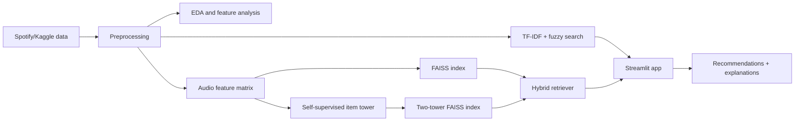
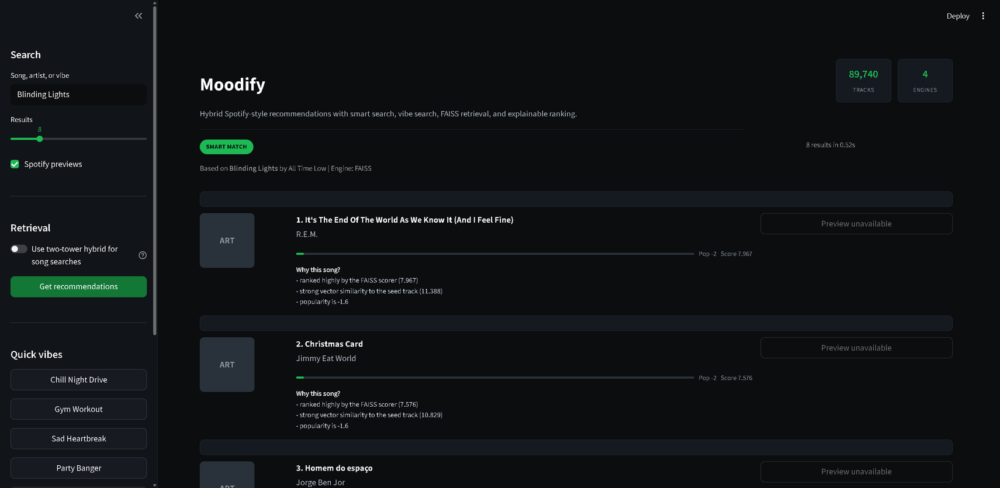

# Moodify: Hybrid Spotify Music Recommendation Engine


Moodify is a music recommendation project that combines Spotify metadata, audio
features, vector search, fuzzy text search, and self-supervised item embeddings
to recommend tracks by song, artist, or natural-language vibe.

This repository is designed as a portfolio project: it shows the full path from
data collection and preprocessing to retrieval, experiment tracking, and an
interactive demo app.

## Why This Project Stands Out

- End-to-end ML pipeline: data ingestion, cleaning, EDA, feature engineering,
  model training, retrieval, and app demo.
- Hybrid recommendation stack: TF-IDF search, fuzzy matching, FAISS vector
  retrieval, mood/vibe search, popularity reranking, and diversity reranking.
- Self-supervised item tower: learns compact track embeddings from Spotify audio
  features using contrastive learning.
- Profile-aware two-tower training: builds user/profile vectors from playlists,
  mood labels, or genres.
- Recruiter-friendly demo surface: Streamlit UI with search, quick vibes,
  configurable result count, Spotify previews, scoring details, and "why this
  song?" explanations.
- Evaluation-ready: includes a metrics script for Precision@K, Recall@K,
  MAP@K, NDCG@K, catalog coverage, artist diversity, and latency.

## Features

- Search by track name, artist, or typo-tolerant partial query.
- Search by vibe, such as `chill night drive`, `gym workout`, `study focus`,
  `sad heartbreak`, or `romantic dinner`.
- Recommend similar tracks using FAISS over normalized audio features.
- Optional two-tower hybrid retrieval using learned item embeddings.
- Re-rank recommendations using similarity, popularity, and artist diversity.
- Explain each recommendation with similarity, popularity, diversity, and audio
  feature signals.
- Display album artwork and Spotify preview links when API credentials are
  available.
- Generate exploratory analysis plots for popularity, mood, and feature
  relationships.

## Architecture



## Tech Stack

- Python, Pandas, NumPy, Scikit-learn
- FAISS for vector similarity search
- TensorFlow and TensorFlow Recommenders for item-tower modeling
- MLflow for experiment tracking
- Spotipy for Spotify API integration
- Streamlit and Flask demo apps
- Matplotlib, Seaborn, Plotly for EDA
- Poetry for dependency management

## Project Structure

```text
app/
  main.py                         Official Streamlit recommendation demo
  __init__.py                     Package marker

legacy/
  app_flask_legacy.py             Legacy Flask demo (archived for reference)
  README.md                       Deprecation explanation

src/
  data_ingestion.py               Kaggle dataset download
  preprocessing.py                Large dataset preprocessing
  eda.py                          EDA report generation
  retrieval/
    faiss_retriever.py            FAISS audio-feature retriever
    hybrid_retriever.py           Two-tower + popularity + diversity reranker
  search/
    smart_search.py               TF-IDF, fuzzy, and vibe search
  models/
    train_item_tower.py           Self-supervised item tower training (SimCLR)
    two_tower_model.py            Profile-aware two-tower training

scripts/
  evaluate_recommender.py       Offline recommendation evaluation harness
  take_screenshots.py             Screenshot automation for README assets

legacy/
  app_flask_legacy.py             Legacy Flask demo (archived)
  app_redirect.py                 Deprecated root app.py redirect
  README.md                       Deprecation explanation
  static/                           Old Flask frontend assets
  templates/                        Old Flask HTML templates
  eda.py                            EDA notebook script

scripts/
  evaluate_recommender.py         Offline recommendation evaluation harness
  take_screenshots.py             Screenshot automation for README assets
  check_df.py                     Data inspection utility
  example_run.py                  Example pipeline run script
  recommendations.py              Mood-based recommendation utility

tests/                              Unit tests (pytest)
.github/workflows/ci.yml            GitHub Actions CI

reports/
  evaluation_summary.md           Offline metrics summary
  evaluation_sample.json          Sample evaluation results

screenshots/                      UI screenshots for portfolio
eda_output/                       Generated EDA plots

README.md                         This file
PROJECT_REPORT.md                 Portfolio case study
QUICKSTART.md                     Detailed setup guide
DEPLOYMENT.md                     Streamlit Cloud, Docker, and Spaces guide
DEPLOYMENT_CHECKLIST.md           Step-by-step Streamlit Cloud deployment
IMPROVEMENTS.md                   Code-quality improvement log
pyproject.toml                    Poetry dependencies
requirements.txt                  pip entry point (references requirements-core.txt)
requirements-core.txt             Core runtime dependencies
Dockerfile                        Docker image for deployment
```

## Quick Start

### 1. Install dependencies

Poetry is recommended for the full project:

```bash
poetry install
```

For the original lightweight pipeline:

```bash
pip install -r requirements.txt
```

### 2. Configure environment variables

Copy `.env.example` to `.env` and fill in your Spotify credentials:

```bash
SPOTIPY_CLIENT_ID=your_client_id
SPOTIPY_CLIENT_SECRET=your_client_secret
SPOTIPY_REDIRECT_URI=http://127.0.0.1:8888/callback
SPOTIFY_CLIENT_ID=your_client_id
SPOTIFY_CLIENT_SECRET=your_client_secret
```

Never commit `.env`, `Auth.env`, or real API credentials.

### 3. Run the Streamlit demo

```bash
poetry run streamlit run app/main.py
```

### 4. Run the legacy Flask demo (optional)

```bash
python legacy/app_flask_legacy.py
```

Then open:

```text
http://localhost:5000
```

## Data and Model Pipeline

### Collect playlist-based data

```bash
python main.py
python run_phase2_phase3.py
```

This creates:

- `labeled_spotify_songs.csv`
- `spotify_songs_cleaned.csv`
- EDA plots in `eda_output/`

### Build the large FAISS index

```bash
poetry run python src/data_ingestion.py
poetry run python src/preprocessing.py
poetry run python src/retrieval/faiss_retriever.py
```

### Train the self-supervised item tower

```bash
poetry run python src/models/train_item_tower.py
```

This creates:

- `models/item_tower/`
- `src/retrieval/tt_faiss.index`
- `src/retrieval/tt_metadata.pkl`

### Train the profile-aware two-tower model

```bash
poetry run python src/models/two_tower_model.py --data data/processed/tracks_large_cleaned.parquet --epochs 10
```

This version builds user/profile vectors from real playlist, mood, or genre
groups.

Outputs:

- `models/profile_two_tower/`
- `models/profile_user_tower/`
- `models/profile_item_tower/`
- `src/retrieval/profile_tt_faiss.index`
- `src/retrieval/profile_tt_metadata.pkl`

## Evaluation

Run the offline evaluation harness:

```bash
python scripts/evaluate_recommender.py --data spotify_songs_cleaned.csv --top-k 10 --sample-size 200
```

Example metrics produced:

- Precision@K
- Recall@K
- MAP@K
- NDCG@K
- catalog coverage
- artist diversity
- average latency per query

Sample output from the current cleaned dataset is available in
`reports/evaluation_sample.json` and summarized in
`reports/evaluation_summary.md`.

These metrics use mood or genre as proxy relevance labels. For production-grade
evaluation, replace proxy labels with real user interactions such as likes,
saves, playlist additions, skips, or repeat plays.

## Screenshots and Demo Assets



*Smart search with TF-IDF + FAISS retrieval showing track recommendations, popularity scores, and "Why this song?" explanations.*

Current visual assets:

- `screenshots/moodify_demo.png` — Streamlit app with text search results
- `eda_popularity.png` — EDA popularity distribution
- `eda_correlation_heatmap.png` — Feature correlation heatmap

Recommended additions:

- 30-60 second demo video (screen recording of a vibe search + track card interactions)
- Deployed live demo on Streamlit Cloud

## Deployment

The official app is `app/main.py`.

```bash
streamlit run app/main.py
```

**Deploy to Streamlit Cloud** (free, recommended):

1. Push this repo to GitHub.
2. Go to [share.streamlit.io](https://share.streamlit.io) and create a new app.
3. Point the entry file to `app/main.py`.
4. Add `SPOTIFY_CLIENT_ID` and `SPOTIFY_CLIENT_SECRET` as secrets if you want Spotify previews.

Deployment options are also documented in `DEPLOYMENT.md`. The repository includes:

- `Dockerfile`
- `.streamlit/config.toml`
- `runtime.txt`
- `packages.txt`

## CI

GitHub Actions is configured in `.github/workflows/ci.yml`. It compiles key
Python files, runs tests, and runs a small recommendation-evaluation smoke test.

## Resume Bullet

Built **Moodify**, an end-to-end hybrid music recommender with **FAISS vector search**, **TF-IDF/fuzzy text retrieval**, **self-supervised contrastive learning** (SimCLR-style item tower), and a **profile-aware two-tower model** trained on real playlist/mood groups. Deployed an interactive **Streamlit** demo with explainable recommendations and Spotify previews; tracked experiments with **MLflow**; achieved **0.47 Precision@10** and **0.49 NDCG@10** on offline evaluation; 19 unit tests with GitHub Actions CI.

## Next Improvements

- Deploy the Streamlit app on **Streamlit Cloud** and add a live demo link.
- Replace proxy profile groups with real listener-level interaction signals.
- Add baseline comparison tables for popularity-only, cosine, FAISS, and hybrid ranking.
- Add a 30-60 second demo video.
- Add `pytest-cov` code-coverage badge to CI.
- Add contributor guidelines (`CONTRIBUTING.md`).
